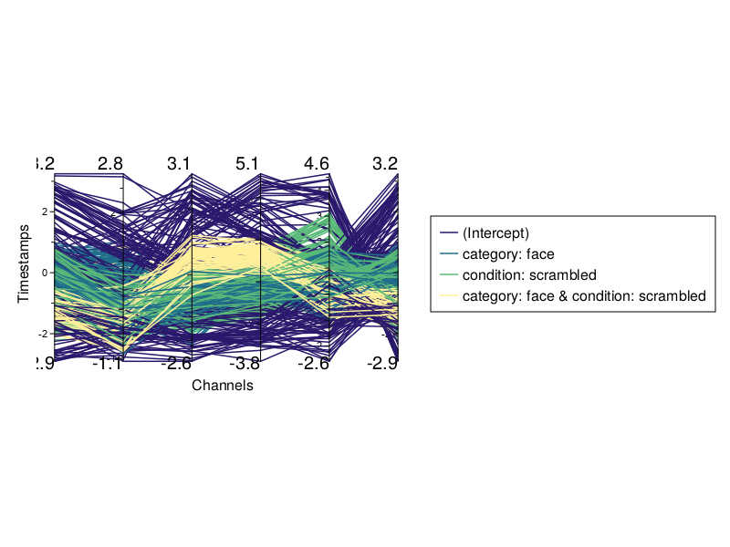
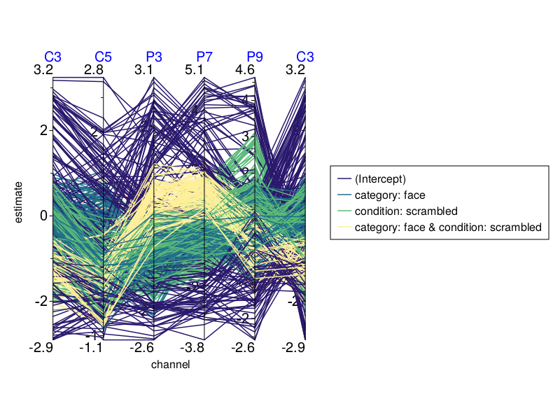

# [Fix Parallel Coordinates Plot](@id ht_fpcp)

Since Makie doesn't have a native function to draw PCPs, our version is somewhat experimental for general use.

Under certain circumstances the PCP is not visualized correctly.
This leads to truncated edges of the PCP and unused space.

In particular, if the container size is changed by adjusting the figure resolution, or if multiple plots are added to a figure, the PCP may not fit.




Since the plot could have more space above and below, we can change the aspect ratio of the plot with:
```
...
pc_aspect_ratio = 1,
...
```

The cut off or overlap at each side can be fixed with:
```
...
pc_right_padding = 15,
pc_left_padding = 45,
pc_top_padding = 50,
pc_bottom_padding = 27,
...
```

Furthermore, if the tick-number size becomes too big or small it can be changed with:
```
...
pc_tick_label_size = 25,
...
```

By setting these manually through trial and error we can fix the visualization issues:


