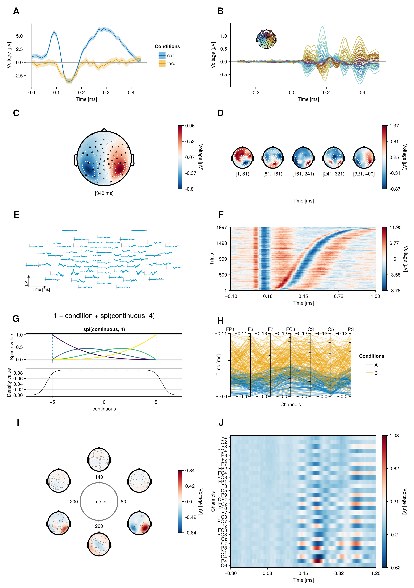

# UnfoldMakie Documentation

```@raw html

```

This is the documentation of the UnfoldMakie.jl module (aka library) for the Julia programming language. 

## Benefits of UnfoldMakie.jl

- 10 plot functions for displaying ERPs. Each one emphasizes certain dimensions while collapsing others.
- Highly customizable. It is based on the [Unfold](https://github.com/unfoldtoolbox/unfold.jl/) and [Make](https://makie.juliaplots.org/stable/) modules, so you can use configurations from those modules to add new features to your plots.

