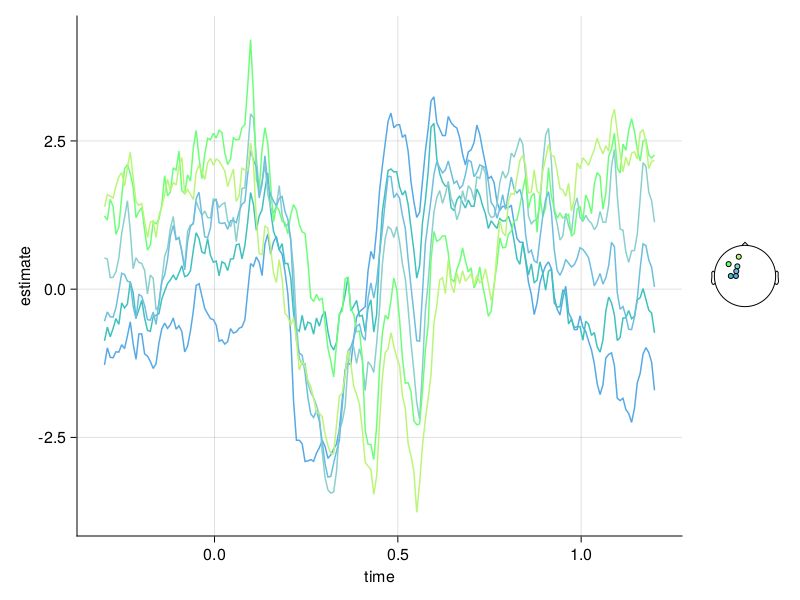

# [Butterfly Plot Visualization](@id bfp_vis)

Here we discuss butterfly plot visualization. 
Make sure you have looked into the [installation instructions](@ref install_instruct).

## Include used Modules
The following modules are necessary for following this tutorial:
```
using UnfoldMakie
using Unfold
using StatsModels # can be removed in Unfold v0.3.5
using DataFrames
using CairoMakie
using DataFramesMeta
```
Note that `DataFramesMeta` is also used here in order to be able to use `@subset` for testing (filtering).

## Data
In case you do not already have data, look at the [Load Data](@ref test_data) section. 

Use the test data of `erpcore-N170.jld2`.

We filter the data to make it more clearly represented:
```
results_plot_butter = @subset(results_onesubject,:coefname .== "(Intercept)",:channel .<7)
```

## Plot Butterfly Plots

The following code will result in the default configuration. 
```
cButter = PlotConfig(:butterfly)
```
At this point you can detail changes you want to make to the visualization through the plot config. These are detailed further below. 

This is how you plot the butterfly plot.
```
cButter.plot(results_plot_butter)
```



## Column Mappings for Butterfly Plots

Since butterfly plots use a `DataFrame` as an input, the library needs to know the names of the columns used for plotting.

For more informations about mapping values look into the [Mapping Data](@ref config_mapping) section of the documentation.

While there are multiple default values, that are checked in order if they exist in the `DataFrame`, a custom name might need to be choosen for:

### x
Default is `(:x, :time)`.

### y
Default is `(:y, :estimate, :yhat)`.

### topoPositions
Default is `(:pos, :positions, :position, :topoPositions, :x, :nothing)`

### topoLabels
Default is `(:labels, :label, :topoLabels, :sensor, :nothing)`

### topoChannels
Default is `(:channels, :channel, :topoChannel, :nothing)`

## Configurations for Butterfly Plots

Here we look into possible options for configuring the butterfly plot visualization using `config.setExtraValues(<name>=<value>,...)`.
By calling the `config.plot(...)` function on a butterfly plot the function `plot_lines(...)` is executed.

For more general options look into the `Plot Configuration` section of the documentation.
This is the list of unique configuration (extraData):
- topoLegend (boolean)

Since the configurations for line plots can be applied to butterfly plots as well.
[Here](@ref lp_vis) you can find the configurations for line plots, 

### topoLegend (boolean)
Indicating whether the topo legend is displayed.
Default is `true`.
