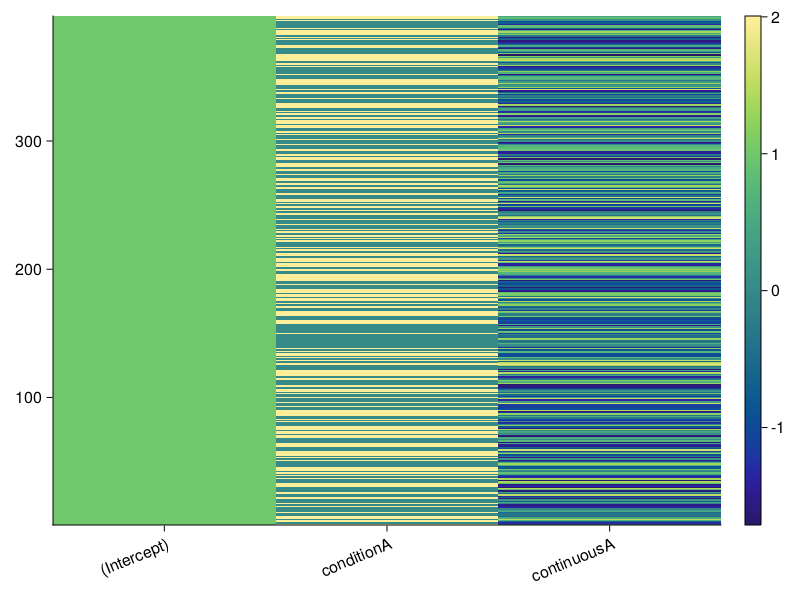
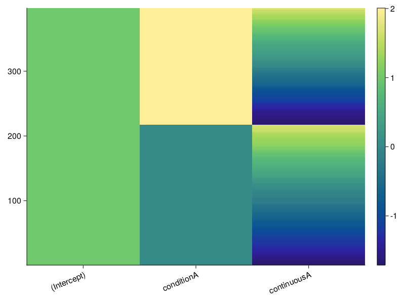

# [Designmatrix Visualization](@id dm_vis)

Here we discuss designmatrix visualization. 
Make sure you have looked into the [installation instructions](@ref install_instruct) section. 

## Include used modules
The following modules are necessary for following this tutorial:
```
using Unfold
using UnfoldMakie
using StatsModels # can be removed in Unfold v0.3.5
using DataFrames
using CairoMakie
```

## Data
In case you do not already have data, look at the [Load Data](@ref test_data) section. 

When you followed the tutorial, using test data of the `Unfold` module, use the following code for further pre-processing:
```
designmatrix(ufMass, evts)
```
When you followed the tutorial, using test data of the file `erpcore-N170.jld2`, use the following code:
```
designmatrix(mres)
```

## Plot Designmatrices

The following code will result in the default configuration. 
```
cDesign = PlotConfig(:design)
```
At this point you can detail changes you want to make to the visualization through the plot config. These are detailed further below. 

This is how you plot the designmatrix, when using data of the `Unfold` module.
```
plot_design(designmatrix(ufMass, evts), cDesign)
```
This is how you finally plot the designmatrix, when using data of the `erpcore-N170.jld2` file.
```
cDesign.plot(designmatrix(mres))
```



## Column Mappings for Designmatrices

Since designmatrix uses an `Unfold.DesignMatrix` as an input, the library does not need any infos about the mapping.

## Configurations for Designmatrices

Here we look into possible options for configuring the designmatrix visualization using `config.setExtraValues(<name>=<value>,...)`.
By calling the `config.plot(...)` function on a designmatrix the function `plot_design(...)` is executed.

For more general options look into the `Plot Configuration` section of the documentation.
This is the list of unique configuration (extraData):
- sortData (boolean)
- standardizeData (boolean)
- xTicks (number)


### sortData (boolean)

Indicating whether the data is sorted; using sortslices() of Base Julia. 
Default is `false`.

In order to make the designmatrix easier to read, you may want to sort it.
The following configuration achieves this:
```
cDesign.setExtraValues(sortData=true)
```



### standardizeData (boolean)
Indicating whether the data is standardized, mapping the values between 0 and 1. 
Default is `true`.


### xTicks (number)
Indicating the number of labels on the x-axis. Behavior if specified in configuration:
- xTicks = 0: no labels are placed.
- xTicks = 1: first possible label is placed.
- xTicks = 2: first and last possible labels are placed.
- 2 < xTicks < number of labels: xTicks-2 labels are placed between the first and last.
- xTicks ≥ number of labels: all labels are placed.