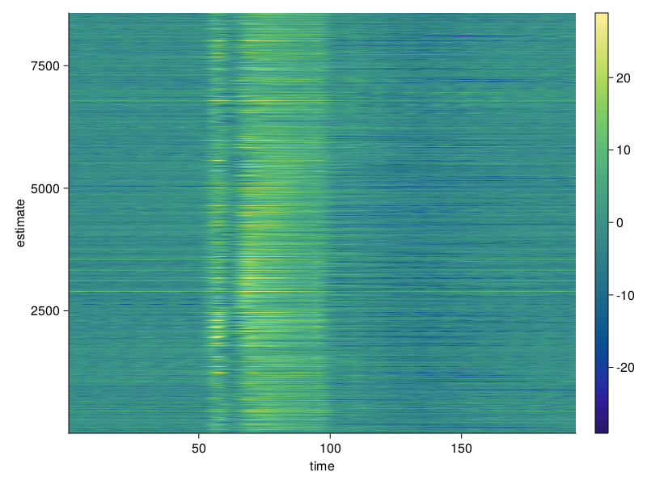
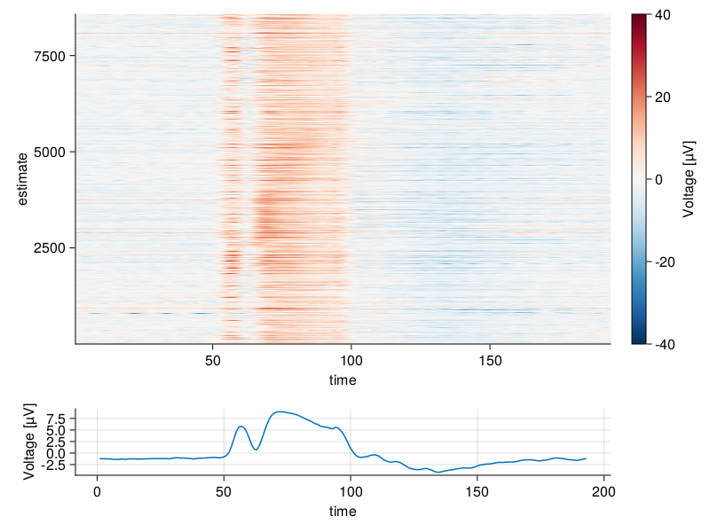

# [ERP Image Visualization](@id erpi_vis)

Here we discuss butterfly plot visualization. 
Make sure you have looked into the [installation instructions](@ref install_instruct).

## Include used Modules
The following modules are necessary for following this tutorial:
```
using Unfold
using UnfoldMakie
using StatsModels # can be removed in Unfold v0.3.5
using DataFrames
using CairoMakie
using DataFramesMeta
using Random
```
Note that `DataFramesMeta` is also used here in order to be able to use `@subset` for testing (filtering).

Note that `Random` is used.

## Data
In case you do not already have data, look at the [Load Data](@ref test_data) section. 

Use the test data of `erpcore-N170.jld2`.
Note that you do not need the pre-processing step detailed in that section.

## Plot ERP Images

The following code will result in the default configuration. 
```
erpConfig = PlotConfig(:erp)
```
At this point you can detail changes you want to make to the visualization through the plot config. These are detailed further below. 

This is how you finally plot the ERP image.
```
plot_erp(dat_e[28,:,:], erpConfig)
```




## Configurations for ERP Images

Here we look into possible options for configuring the ERP image visualization.
The options for configuring the visualization mentioned here are specific for ERP images.
For more general options look into the `Plot Configuration` section of the documentation.
This is the list of unique configuration (extraData):
- erpBlur (number)
- meanPlot (boolean)
- sortData (boolean)


### erpBlur (number)
Is a number indicating how much blur is applied to the image; using Gaussian blur of the ImageFiltering module. 
Default value is `10`. Negative values deactivate the blur.


### meanPlot (boolean)
Indicating whether the plot should add a line plot below the ERP image, showing the mean of the data.
Default is `false`.


### sortData (boolean)
Indicating whether the data is sorted; using sortperm() of Base Julia 
(sortperm() computes a permutation of the array's indices that puts the array into sorted order). 
Default is `false`.


...

```
erpConfig = PlotConfig(:erp)
erpConfig.setExtraValues(;ylims = (low = 3650, high = 8000),
	ylabel = "Sorted trials",
	meanPlot = true)
erpConfig.setColorbarValues(;label = "Voltage [µV]")
erpConfig.setVisualValues(;colormap = Reverse("RdBu"), colorrange = (-40, 40))
```




## TODO: MORE CONFIG DETAILS ONCE FINISHED
- description
- is DataFramesMeta needed here?
- Link to config + more detail?