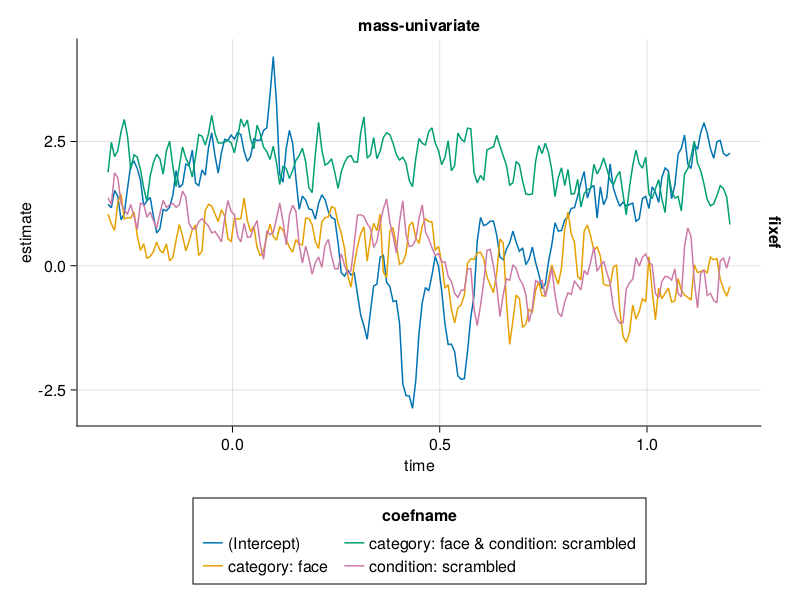
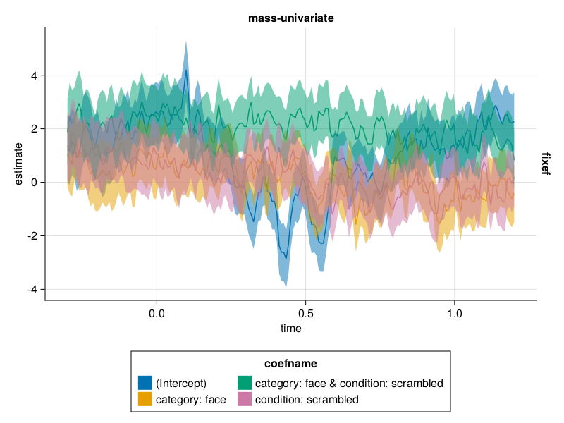
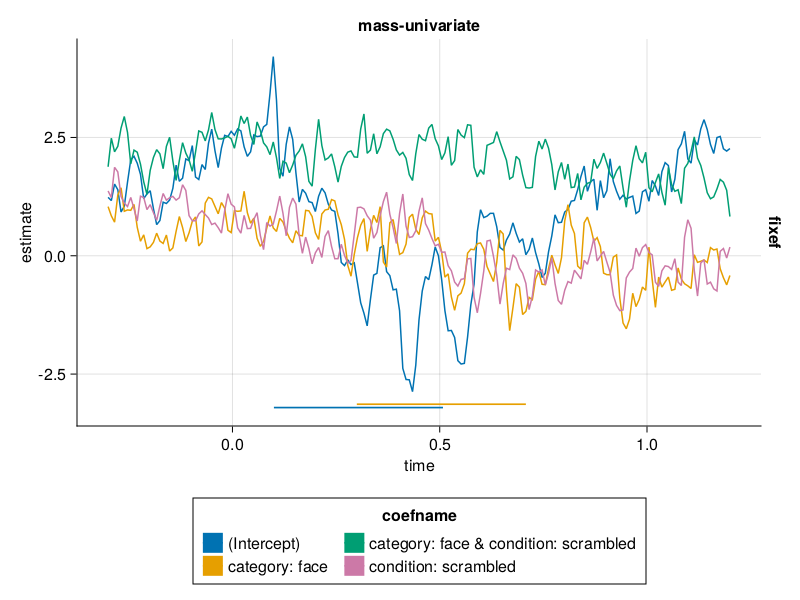

## [Line Plot Visualization](@id lp_vis)

Here we discuss line plot visualization. 
Make sure you have looked into the [installation instructions](@ref install_instruct).

### Include used Modules
The following modules are necessary for following this tutorial:
```
using Unfold
using UnfoldMakie
using StatsModels # can be removed in Unfold v0.3.5
using DataFrames
using CairoMakie
using DataFramesMeta
```
Note that `DataFramesMeta` is also used here in order to be able to use `@subset` for testing (filtering).

### Data
In case you do not already have data, look at the [Load Data](@ref test_data) section. 

Use the test data of `erpcore-N170.jld2`.

We filter the data to make it more clearly represented:
```
results_plot = @subset(results_onesubject,:channel .==3)
```

### Plot Line Plots

The following code will result in the default configuration. 
```
cLine = PlotConfig(:lineplot)
```
At this point you can detail changes you want to make to the visualization through the plot config. These are detailed further below. 

This is how you finally plot the line plot.
```
plot_line(results_plot, cLine)
```


## Configuration for Line Plots

Here we look into possible options for configuring the line plot visualization.
The options for configuring the visualization mentioned here are specific for line plots.
For more general options look into the Plot Configuration section of the documentation.

Using some general configurations we can pretty up this default visualization. Here we use the following configuration:
```
cLine.setExtraValues(showLegend=true,
    categoricalColor=false,
    categoricalGroup=false)
cLine.setMappingValues(color=:coefname, group=:coefname)
cLine.setLegendValues(nbanks=2)
cLine.setLayoutValues(legendPosition=:bottom)
```


Note that you may need the names when setting mapping values to the data you use.
In the following we will use this "pretty" line plot as a basis for looking into configuration options.

### stderror (boolean)
Indicating whether the data estimates should be complemented 
with lower and higher estimates based on the stderror. 
Lower estimates is gained by pointwise subtraction of the stderror from the estimates. 
Higher estimates is gained by pointwise addition of the stderror to the estimates. 
Both estimates are then included in the mapping. 
Default is `false`.

In case you add `stderror=true` when setting extra values, you get a visualization that displays them.
```
cLine.setExtraValues(
    categoricalColor=false,
    categoricalGroup=false,
    stderror=true)
cLine.setMappingValues(color=:coefname, group=:coefname)
cLine.setLegendValues(nbanks=2)
cLine.setLayoutValues(legendPosition=:bottom)
```


Note that you may need to the names when setting mapping values to the data you use.

### pvalue (array)
Is an array of p-values. If array not empty, complement data by adding p-values.
Default is an empty array, `nothing`.

In case you have `pvalue` defined in the extra values, it will be displayed in the visualization.
In the following you can see a simple definition.
```
cLine = PlotConfig(:lineplot)

pvals = DataFrame(
		from=[0.1,0.3],
		to=[0.5,0.7],
		coefname=["(Intercept)","category: face"] # if coefname not specified, line should be black
	)

cLine.setExtraValues(
    categoricalColor=false,
    categoricalGroup=false,
    pvalue=pvals)
cLine.setMappingValues(color=:coefname, group=:coefname)
cLine.setLayoutValues(legendPosition=:bottom)
cLine.setLegendValues(nbanks=2)
plot_line(results_plot, cLine)
```


Note that you may need to the names when setting mapping values to the data you use.