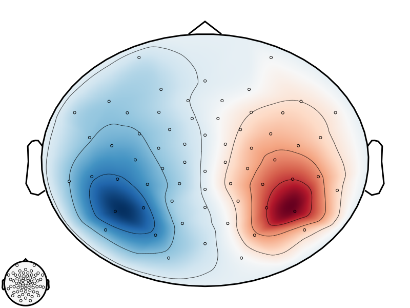
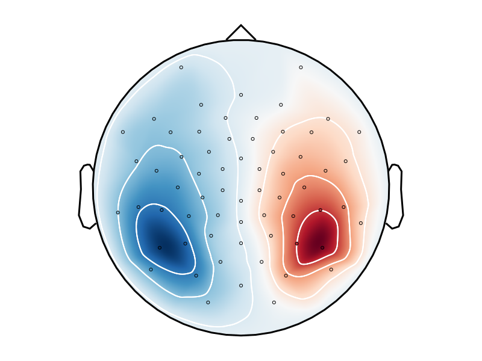
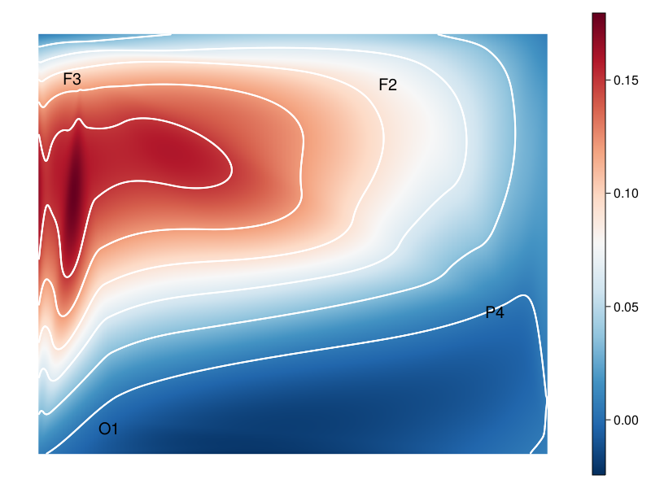

## [Topo Plot Visualization](@id tp_vis)

Here we discuss topo plot visualization. 
Make sure you have looked into the [installation instructions](@ref install_instruct).

### Include used modules
The following modules are necessary for following this tutorial:
```
using Unfold
using UnfoldMakie
using StatsModels # can be removed in Unfold v0.3.5
using DataFrames
using CairoMakie
using TopoPlots
```
To visualize topo plots we use the `TopoPlots` module.

### Data

Topo plots can be visualized either by data from the `TopoPlots` module, or from a `DataFrame`.
Both function very similar, though the dataframe needs some extra attention regarding the input.

### Plot Topo Plots

## Giving the Data

Using the `TopoPlots` is very straight forward.

In case you do not already have data, you can get example data from the `TopoPlots` module. 
You can do it like this:
```
data, positions = TopoPlots.example_data()
```

The following code will result in the default configuration. 
```
cTopo = PlotConfig(:topo)
```
At this point you can detail changes you want to make to the visualization through the plot config. 

This is how you plot the topo plot. We only use one part of the data while giving all the positions
```
cTopo.plot(data[:, 340, 1]; positions=positions)
```


Using a `DataFrame` means the correct column names have to be put into the mapping values, more on that is detailed further below.

Once set, the `DataFrame` can be put into the function directly
```
cTopo.plot(dataframe)
```

## Giving the positions

Since the topo plot needs the positions of the sensors they have to be put into the drawing function. But there are multiple options (In order of prioritization):

- Giving the positions directly: `cTopo.plot(...; positions=[...])`
- Giving the labels of the sensors: `cTopo.plot(...; labels=[...])`
- (Only with `DataFrame`) Giving a column name with channels in that column by setting the mapping value

To get the positions from the labels we use a [database](https://raw.githubusercontent.com/sappelhoff/eeg_positions/main/data/Nz-T10-Iz-T9/standard_1005_2D.tsv).

To get the positions from the channels we use a set from the [PyMNE Library](https://juliapackages.com/p/pymne).

### Plot EEG Topo Plots

There is an alternative version of the topo plots showing a representation of a head, with the same features as the one seen above.

We suggest additionally setting the aspect ratio in the Axis values to `DataAspect()`.
This results in a round plot

```
data, positions = TopoPlots.example_data()

cTopo = PlotConfig(:eegtopo)

cTopo.setAxisValues(aspect = DataAspect())

cTopo.plot(data[:, 340, 1]; positions=positions)
```





## Column Mappings for Topo Plots

When using topo plots with a `DataFrame` as an input, the library needs to know the names of the columns used for plotting.

For more infos about mapping values look into the [Mapping Data](@ref config_mapping) section of the documentation.

While there are multiple default values, that are checked in order if they exist in the `DataFrame`, a custom name might need to be choosen for:

Note that only one of `topoPositions`, `topoLabels` , or `topoChannels` have to be set to draw a topo plot. If multiple are set, they will be prioritized in that order.

### topodata
Default is `(:topodata, :data, :y)`.

### topoPositions (See note above)
Default is `(:pos, :positions, :position, :topoPositions, :x, :nothing)`.

### topoLabels (See note above)
Default is `(:labels, :label, :topoLabels, :sensor, :nothing)`.

### topoChannels (See note above)
Default is `(:channels, :channel, :topoChannel, :nothing)`.


## Configurations for Topo Plots

Instead of extra settings, topo plots only feature a few settings that can be changed in the visual settings using `config.setVisualValues(<name>=<value>,...)`.

By calling the `config.plot(...)` function on a topo plot the function `plot_topo(...)` is executed.
For more general options look into the `Plot Configuration` section of the documentation.

### label_text (boolean)
Indicates whether label should drawn next to their position.
The labels have to be given into the function seperately:
- For `TopoPlots` data use: `cTopo.plot(...; labels=[...])`
- For a `DataFrame` give a valid column name of a column with the labels (see above for more info on column mapping)

Default is `true`.

### label_scatter (boolean)
Indicates whether the dots should drawn at the given positions.

Default is `true`.

```
data, positions = TopoPlots.example_data()

cTopo = PlotConfig(:topo)

cTopo.setVisualValues(label_scatter = false)

cTopo.plot(data[1:4, 340, 1]; labels=["O1", "F2", "F3", "P4"])
```

